# FashionEcom ERD

> Source of truth: `backend/src/modules/*/entities/*.entity.ts`. ERD la derived view, update cung commit khi sua entity. Ref: CROSS-0007

**Tong**: 63 entities, 21 modules
**Last sync**: 2026-04-18

## Module: Auth & Users

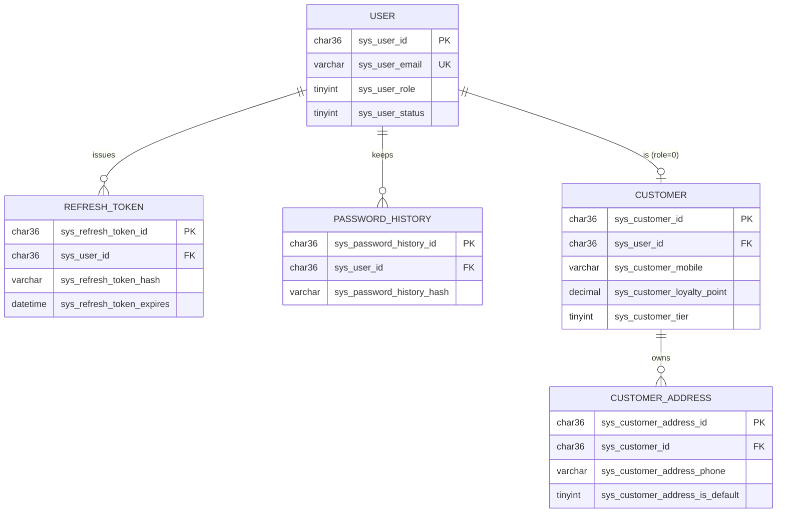

## Module: Catalog (Products + Categories + Attributes)

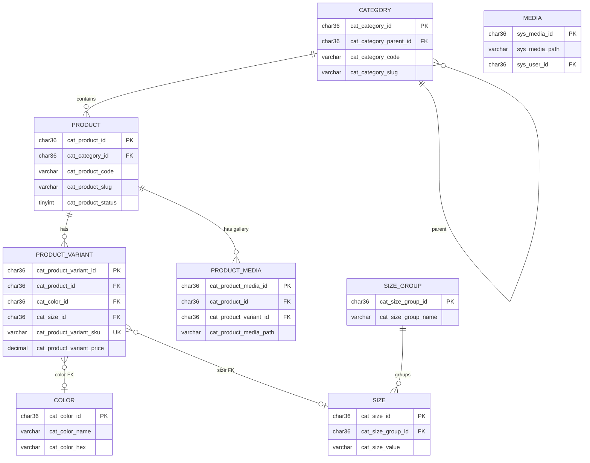

## Module: Order & Payment

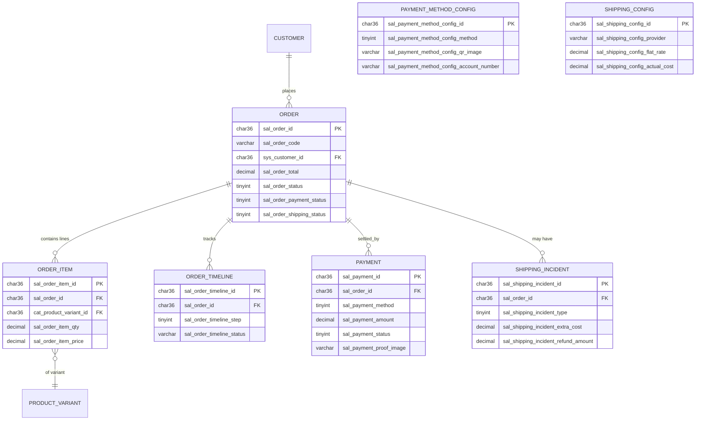

## Module: Inventory & Suppliers

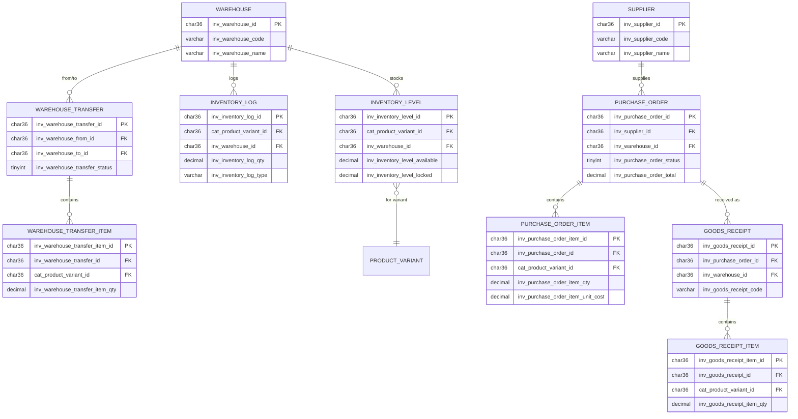

## Module: Promotions (Discount + Flash Sale + Sale Campaign)

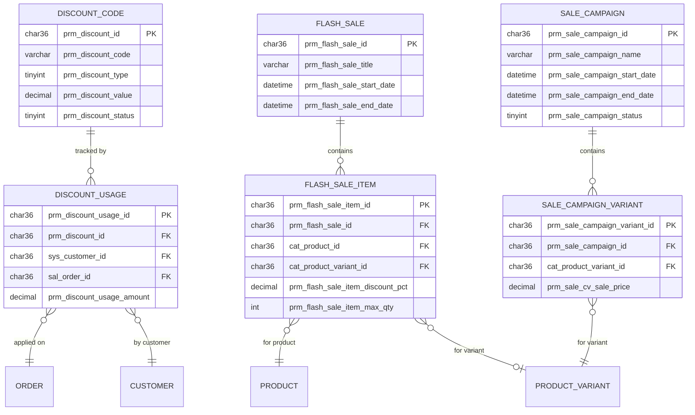

## Module: Returns (RMA)

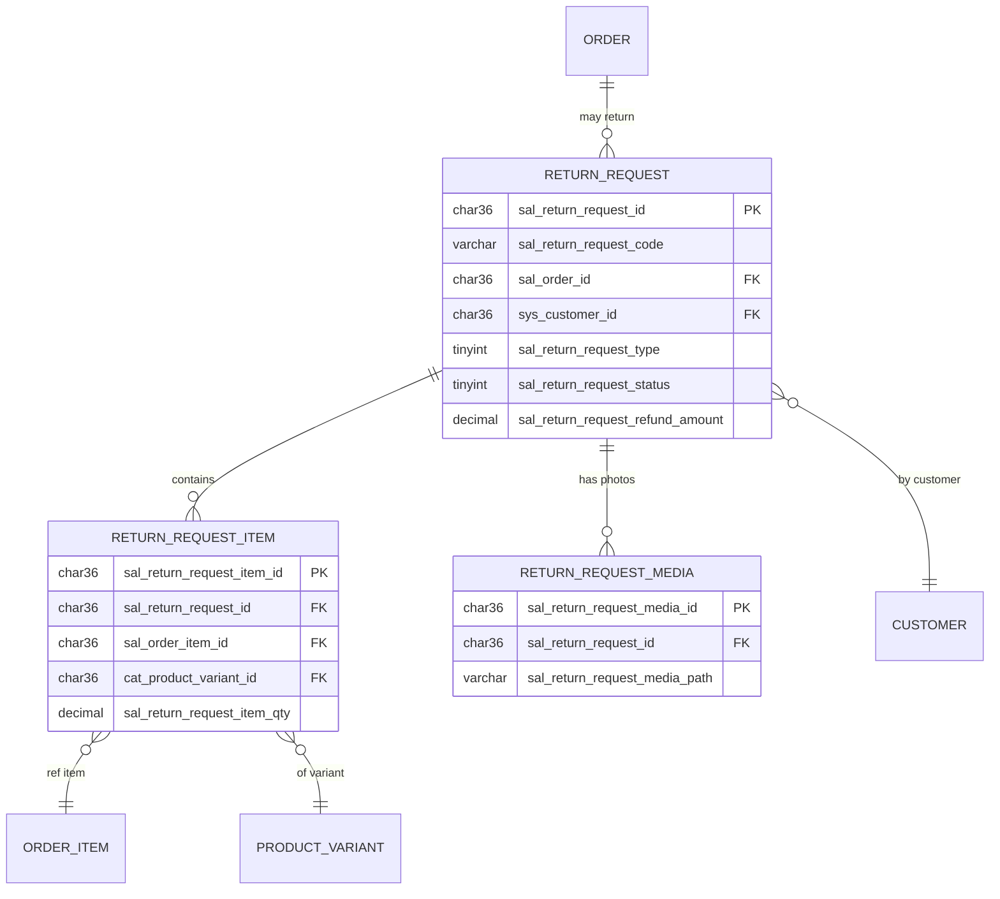

## Module: Loyalty & Reviews

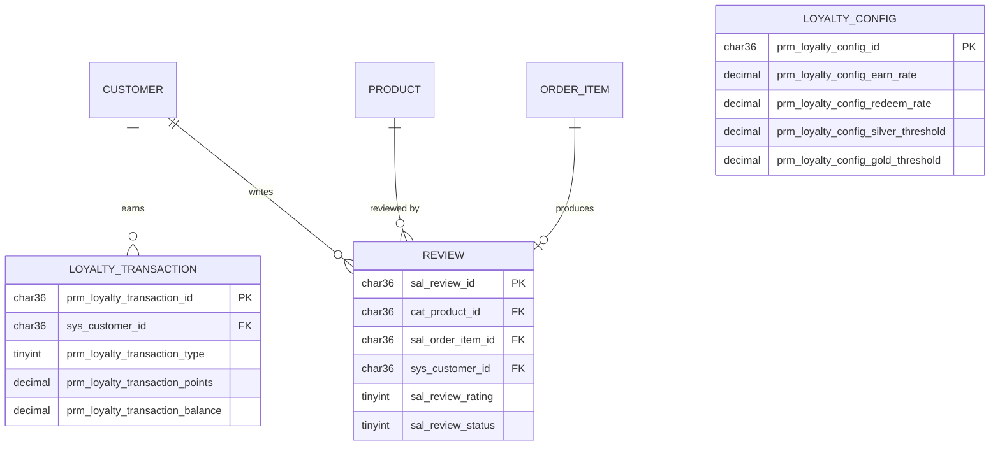

## Module: CMS / Layout

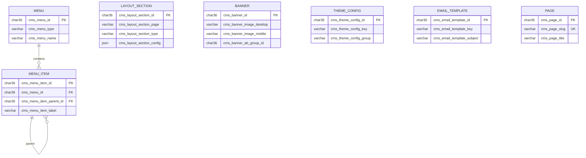

## Module: Notifications & Push

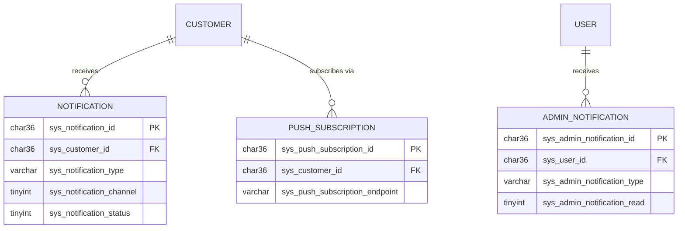

## Module: Analytics & Reports

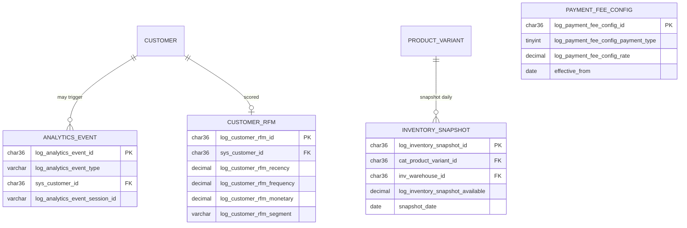

## Module: Logs & Audit & Security

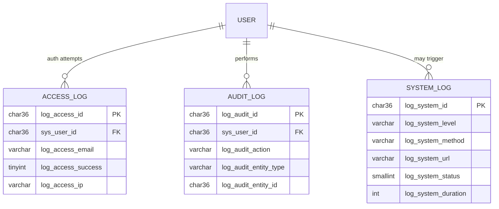

## Module: Settings / Integrations / Guides

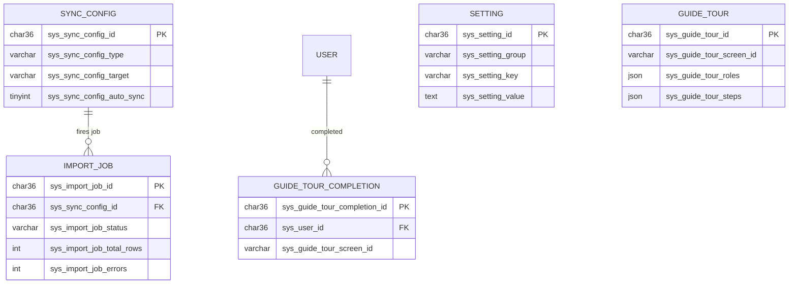

## Cross-module relationships (tom tat)

- `ORDER.sys_customer_id` → CUSTOMER (Auth)
- `ORDER_ITEM.cat_product_variant_id` → PRODUCT_VARIANT (Catalog)
- `INVENTORY_LEVEL.cat_product_variant_id` → PRODUCT_VARIANT
- `PURCHASE_ORDER_ITEM.cat_product_variant_id` → PRODUCT_VARIANT
- `WAREHOUSE_TRANSFER_ITEM.cat_product_variant_id` → PRODUCT_VARIANT
- `DISCOUNT_USAGE.sal_order_id` → ORDER, `.sys_customer_id` → CUSTOMER
- `FLASH_SALE_ITEM.cat_product_id` → PRODUCT, `.cat_product_variant_id` → PRODUCT_VARIANT
- `SALE_CAMPAIGN_VARIANT.cat_product_variant_id` → PRODUCT_VARIANT
- `RETURN_REQUEST.sal_order_id` → ORDER, `.sys_customer_id` → CUSTOMER
- `RETURN_REQUEST_ITEM.sal_order_item_id` → ORDER_ITEM
- `REVIEW.cat_product_id` → PRODUCT, `.sal_order_item_id` → ORDER_ITEM, `.sys_customer_id` → CUSTOMER
- `LOYALTY_TRANSACTION.sys_customer_id` → CUSTOMER
- `INVENTORY_SNAPSHOT.cat_product_variant_id` → PRODUCT_VARIANT, `.inv_warehouse_id` → WAREHOUSE
- `CUSTOMER_RFM.sys_customer_id` → CUSTOMER
- `SHIPPING_INCIDENT.sal_order_id` → ORDER

## Conventions

- Tat ca PK la `char(36)` UUID (sinh boi MySQL `UUID()`).
- Prefix bang theo domain:
  - `sys_*` — auth, user, customer, settings, notifications, media
  - `cat_*` — catalog (product, category, color, size)
  - `inv_*` — inventory, supplier, warehouse
  - `sal_*` — sales (order, payment, shipping, review, return)
  - `prm_*` — promotions (discount, flash sale, sale campaign, loyalty)
  - `cms_*` — content management (banner, menu, page, theme, email)
  - `log_*` — analytics, audit, access, system, RFM, snapshot
- Audit columns chuan: `created_date`, `modified_date` / `updated_date`.
- Status: tinyint enum (0=inactive/draft, 1=active, ...)
